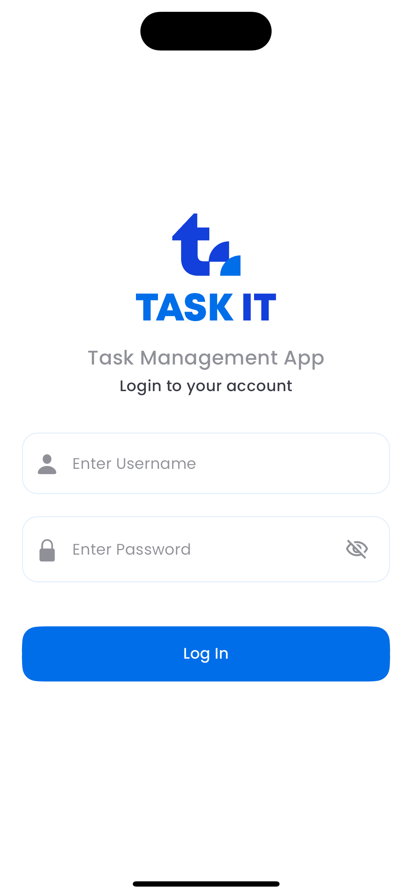
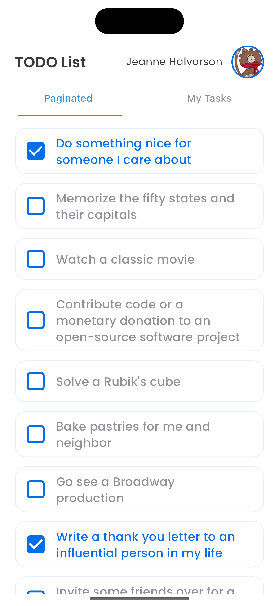
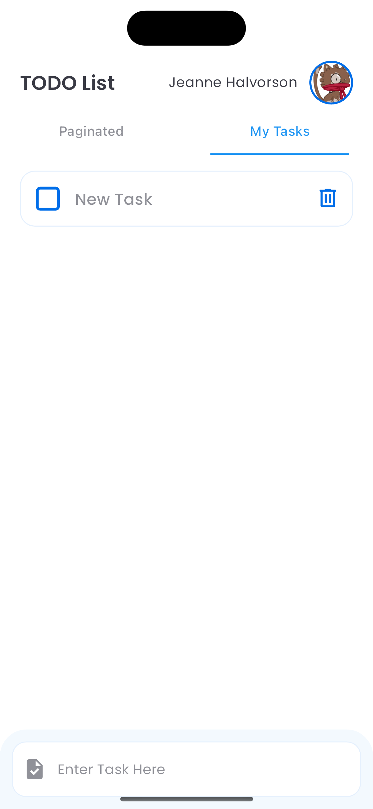
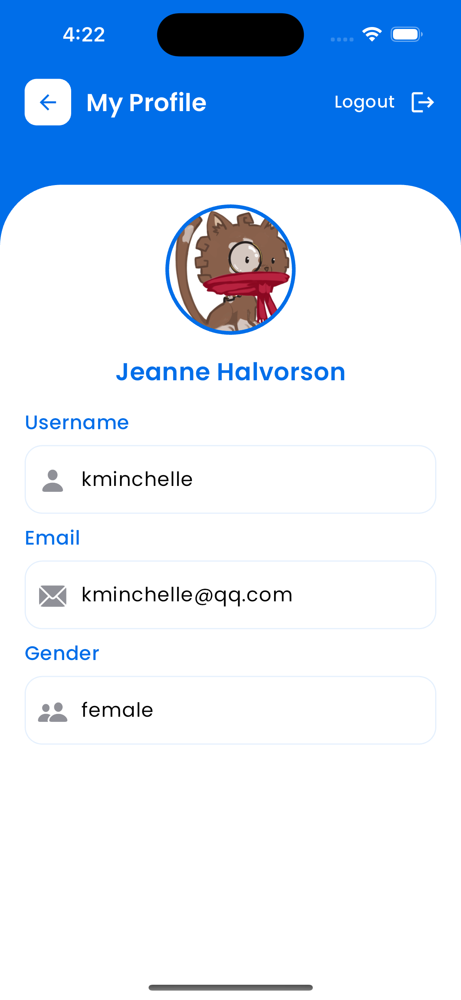
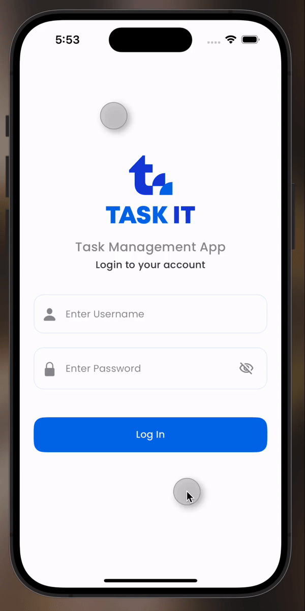

<div align='center'>

<h1 style="border-bottom: none">
</h1>

A minimalistic `TODO` app built with **`Flutter`**. State management is handled by **`Provider`**, and local databases **`Share Preferences`**. The project follows **`Stacked Architecture`** principles for a modular codebase.
</div>

# Design Decision
- **Architecture:** The Stacked Architecture, based on the MVVM pattern, was used for its simplicity and structured approach to organizing code. It also comes with its own CLI tool, which automates many tasks and reduces development time.

- **State Management:** Provider was used for state management due to its seamless integration with Flutter and the Stacked Architecture. It provides a straightforward way to manage the state of the application, allowing for efficient data flow and easy access to shared data across the widget tree.

- **Local Database:** Shared Preferences was chosen for local data storage because it provides a simple key-value storage system, which is easy to use and sufficient for storing user preferences and other small amounts of data.


# Additional Features
- **Current User Page:** An additional feature implemented in this project is a dedicated page for the current user. Here, users can view their personal information, providing a personalized experience within the app.

- **Authentication Token Expiry Check:** The application also checks the expiry of the authentication token. When the token expires, the user is automatically logged out. This feature enhances the security of the application by ensuring that sessions are not indefinitely active, reducing the risk of unauthorized access.


Package | Usage
------------ | -------------
[google_fonts](https://pub.dev/packages/google_fonts) | Flutter package to use fonts from fonts.google.com.
[flutter_screenutil](https://pub.dev/packages/flutter_screenutil) | A flutter plugin for adapting screen and font size.Let your UI display a reasonable layout on different screen sizes.
[shared_preferences](https://pub.dev/packages/shared_preferences) | Wraps platform-specific persistent storage for simple data (NSUserDefaults on iOS and macOS, SharedPreferences on Android, etc.).
[smooth_corner](https://pub.dev/packages/smooth_corner) | The smooth rounded corners of iOS are implemented in Flutter, imitating Figma's "corner smoothing" function. 
[stacked](https://pub.dev/packages/smooth_corner) | Stacked is a Flutter Framework for building Production Applications. It is a complete frontend architecture for Flutter. The framework is created to build testable and maintainable code.
[stacked_services](https://pub.dev/packages/stacked_services) | A package that contains some default implementations of services required for a cleaner implementation of the Stacked Architecture.
[stacked](https://pub.dev/packages/smooth_corner) | Stacked is a Flutter Framework for building Production Applications. It is a complete frontend architecture for Flutter. The framework is created to build testable and maintainable code.


## Design

- [Figma](https://www.figma.com/design/OVIvxeyvAkgDhn7mCriZq4/Untitled?node-id=0%3A1&t=b3vddmLhoGwkgGlD-1)

## Features
-  Login User
-  User Profile
-  Pagination
-  Local data base (Shared Preferences)
-  Task creation.
-  Task editing.
-  Task deletion.
-  Task completion tracking.


### 📸 Screenshots

    

## Demo

<p align="center">
  
</p>


## Getting Started

To get started with this project, follow these steps:

1. **Clone the Repository:**

Replace `IBRAHIMBNC` with your GitHub username and `task_manager` with the name of your GitHub repository.

2. **Install Flutter:**
- Follow the official [Flutter installation guide](https://flutter.dev/docs/get-started/install) to install Flutter on your machine.

3. **Install Dependencies:**
- Navigate to the project directory and run:
  ```
  flutter pub get
  ```

4. **Run the App:**
- Connect a device or start an emulator.
- Run the following command:
  ```
  flutter run
  ```
